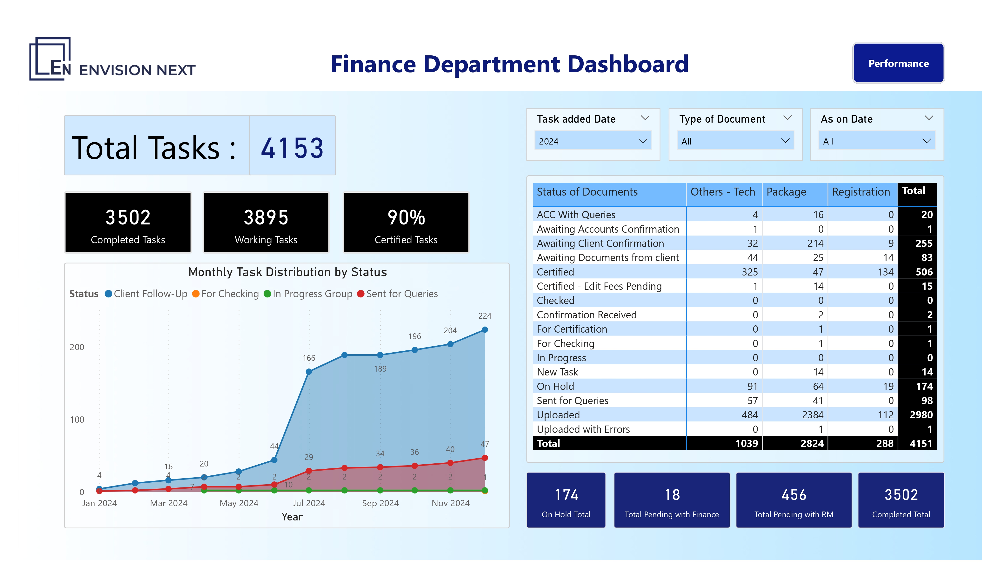
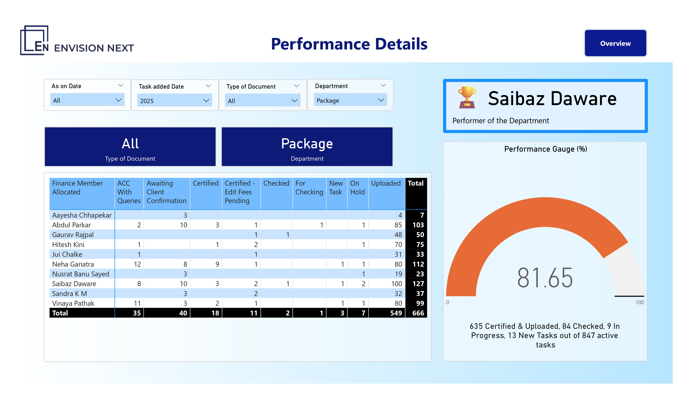
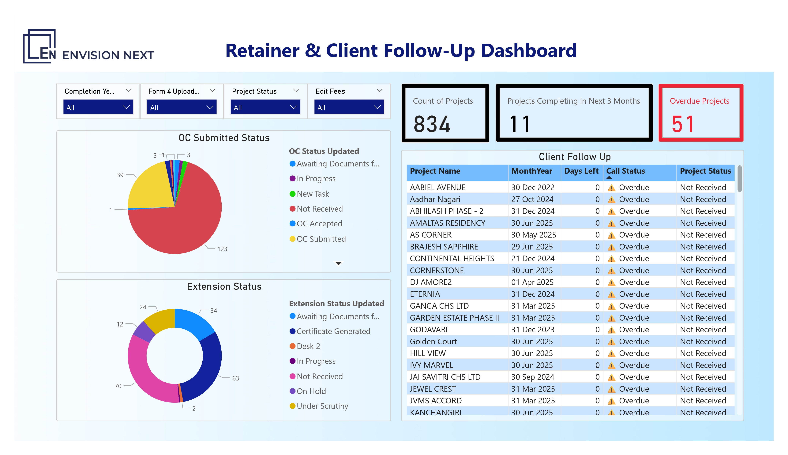
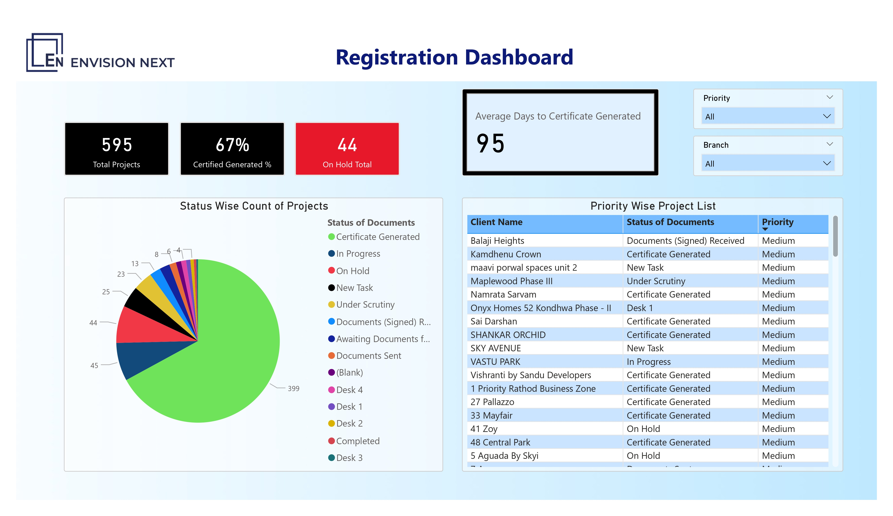

# 📊 CRM Departmental Dashboards – Power BI Project

An interactive Power BI project built to track and analyze the workflows of three core departments involved in CRM operations: **Finance**, **Registration**, and **Retainer & Client Follow-Up**. Each dashboard is tailored to offer quick, actionable insights for both operational teams and decision-makers.

> ⚠️ For confidentiality reasons, the actual `.pbix` files and raw datasets are not included. Visuals and metrics shown here are representative.

---

## 💡 What’s This Project About?

Every department has its own moving parts — from pending tasks and delayed approvals to certificates waiting to be processed. These dashboards were designed to simplify the chaos:

- **Visualize key performance indicators (KPIs) at a glance**
- **Track where things are stuck and who's responsible**
- **Spot trends, delays, and top performers over time**

Whether it's identifying a bottleneck or recognizing high-performing team members, this project brings **clarity to operations**.

---

## 🏦 Finance Department Dashboard

The Finance dashboard gives a bird’s eye view of document status across the department. It highlights how each team member is performing, which documents are getting certified or stuck, and how overall productivity is trending.

🔹 Understand team workload distribution  
🔹 Spot who’s driving the most impact  
🔹 Monitor task flow over time with simple visuals

   
  
    
  

---

## 🧾 Retainer & Client Follow-Up Dashboard

This dashboard helps keep client-related projects in check — especially those nearing completion or needing attention. Whether it's a pending document, an OC that hasn’t arrived, or a delayed submission, it all shows up here clearly.

🔹 Stay ahead of deadlines  
🔹 Follow up efficiently with the right clients  
🔹 See overdue projects and act fast

  

---

## 🏢 Registration Dashboard

The Registration dashboard focuses on how fast and efficiently projects move through the certificate generation process. It breaks down delays, desk-wise workloads, and overall progress.

🔹 Track certificate statuses at every step  
🔹 Know which desks are under load  
🔹 Understand average turnaround time

  

---

## ✨ Why This Matters

- Designed to **save time**, reduce follow-ups, and improve transparency  
- Helps leadership **focus on blockers**, not just numbers  
- Empowers team leads to **recognize and reward** their top performers  
- Fully scalable — can be expanded to other departments or use cases

---

## 🧑‍💼 About the Creator

Built by **Aryan Parte** – Business Intelligence Intern @ Envision Next  
Focused on turning raw data into clear, human-friendly insights.

> *Feel free to reach out on [LinkedIn](https://linkedin.com/in/aryanparte) for collaboration or questions!*
